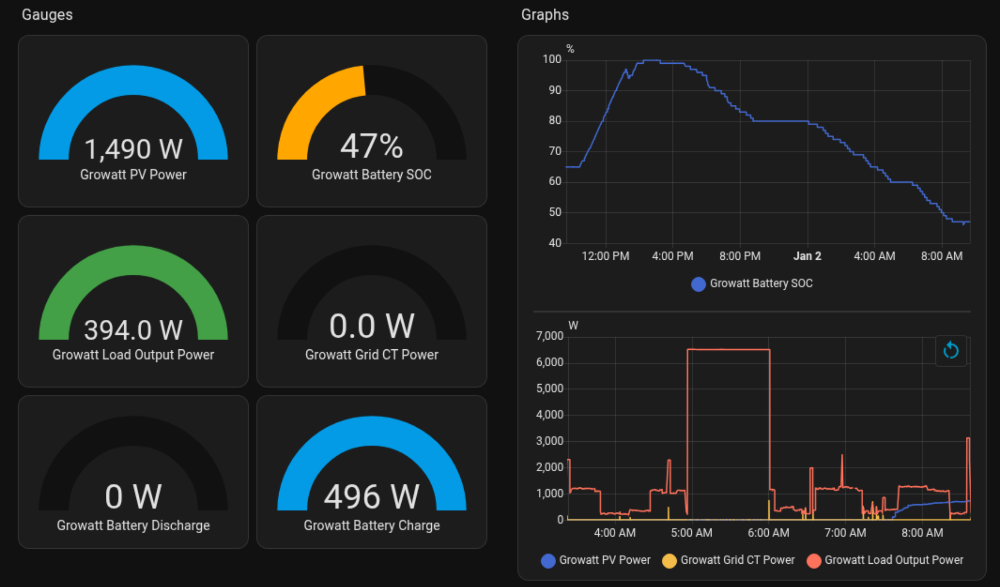
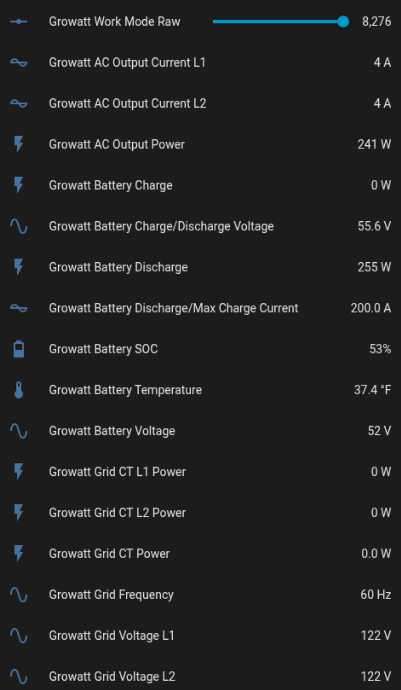
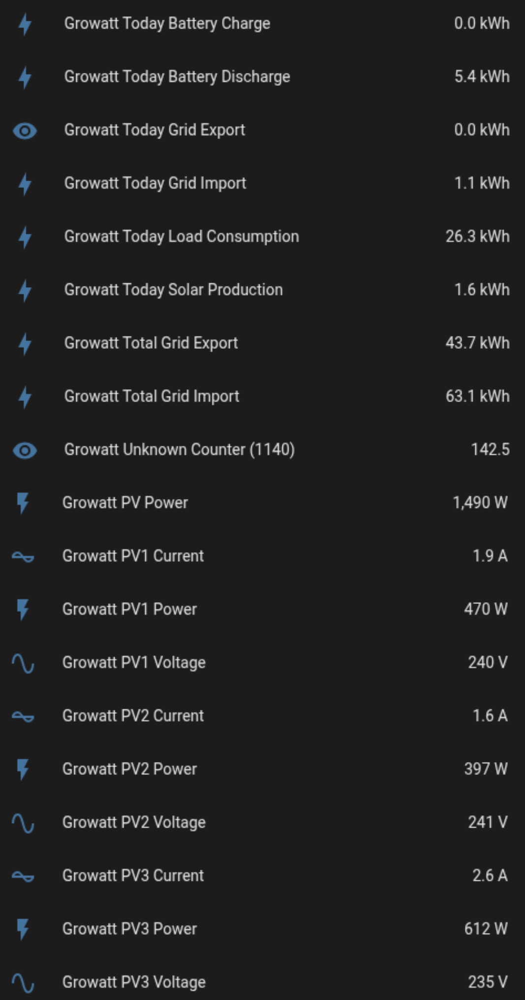

Direct Growatt - RS485 - Home Assistant integration
----

# What This Is

This project aims to interface `Home Assistant` with a Solar inverter (focusing on Growatt) directly via RS485 (Modbus),
eliminating intermediaries like SA.

# Status

Currently data for most telemetry can be extracted in realtime.  Controlling the inverter is not yet supported.

Some of the values are sometimes wrong (work in progress).

Feel free to submit PRs to fix these issues.

Feel free to submit PRs to add support for other inverters.

# Hardware Requirements

* Currently only tested with the Growatt `SPH 10000TL-HU-US-B` running HMI Version `SK110.04-08051`
* A Microcontroller like an `ESP32`  (I used a generic `ESP32-C6`, but custom devices like LilyGO T-CAN485 may be simpler)
* A RS485 module for the microcontroller (If not built-in).  I used a HiLetgo TTL to RS485 because it works at 3.3v like the ESP32.  It's connected via 4 pins (UART): TX (6), RX (7), GND, VCC (see yaml)
* A sacrificial ethernet cable (pinout below), connected to the RS485 module (by cutting it in half)

# Pinout

| Pin | Function | T568B Cable Colors |
| --- | --- | --- |
| 1 | RS485 B- | Orange/White |
| 2 | RS485 A+ | Orange |

# Software Requirements

* Home Assistant (you can use docker)
* ESPHome Builder (you can use docker as well, can be installed on a different machine)

# Installation

* Follow the ESPHome Builder instructions to install ESPHome on your microcontroller.  You may need to use web.esphome.io to initialize a new MCU.
* Create a new ESPHome device in ESPHome Builder.  It will generate the top of your yaml file with MCU and authentication details.
* Ensure that the auto-generated config loads on the microcontroller (it will do nothing)  
* The device should appear in Home Assistant.
* Add the contents of the yaml file in this repo to the yaml file in ESPHome Builder, and reinstall.

# Results

Manually Created Dashboard

Misc values |  More Values
:-------------------------:|:-------------------------:
 | 

