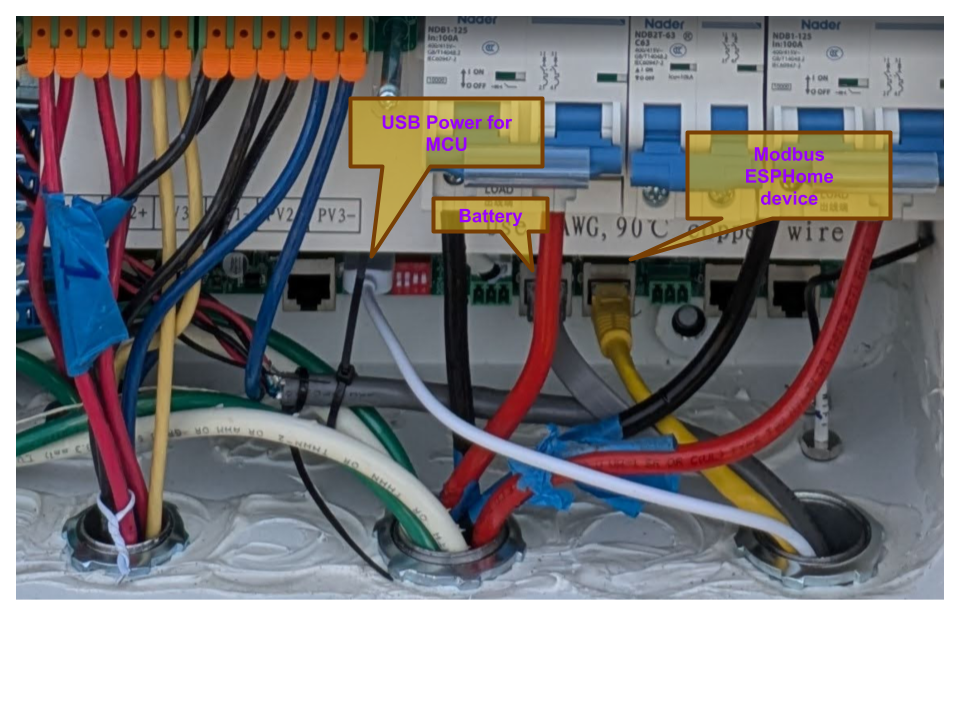
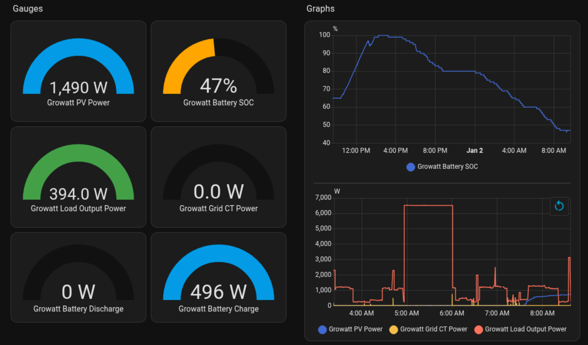
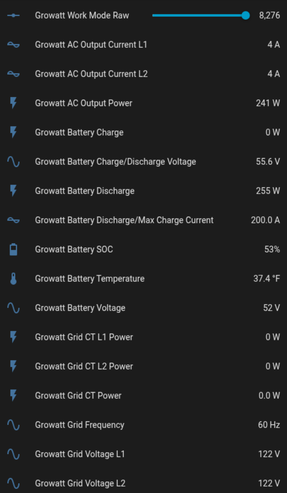
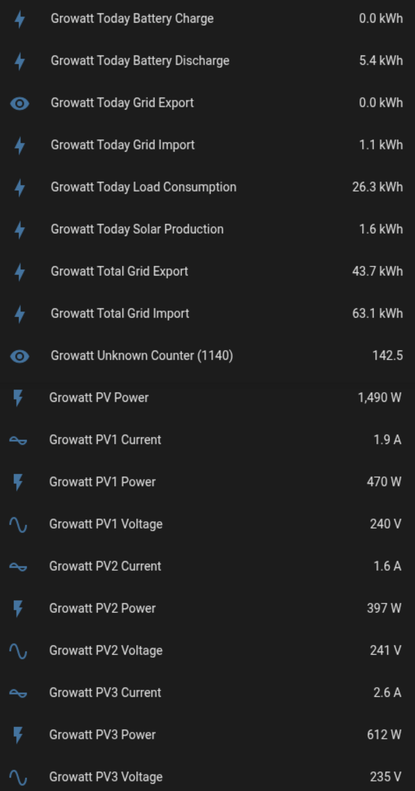

Direct Growatt - RS485 - Home Assistant integration
----

# What This Is

This project aims to interface `Home Assistant` with a Solar inverter (focusing on Growatt) directly via RS485 (Modbus),
eliminating intermediaries like SA.

# Status

## Reading from MODBUS

See [esphome-growatt-sph1000tl-hu-us-b.yaml](esphome-growatt-sph1000tl-hu-us-b.yaml)

Currently data for most telemetry can be extracted in realtime.  
Controlling the inverter is not yet(?) supported, aside for setting the clock 
        (inverter does not support Daylight Savings Time changes)

## Messing with inverter lithium battery charge rate and limiting SOC

See [esphome-growatt-mitm-can-interceptor.yaml](esphome-growatt-mitm-can-interceptor.yaml)

This is an entirely distinct esphome config for a device with two CAN interfaces that
can be placed between inverter and battery to mess with CAN fram 0x351 (pylontech charge rate)
using Home Assistant.

Feel free to submit PRs to fix any issues.

Feel free to submit PRs to add support for other inverters.

# Hardware Requirements

*Currently only tested with the Growatt `SPH 10000TL-HU-US-B` running HMI Version `SK110.04-08051`*

1. Wiring (inverter to RS485 interface), eg a sacrificial ethernet cable, cut in half (pinout below).
2. A Microcontroller like an `ESP32` with a RS485 interface.  A few ways to achieve that:
   * An ESP32 with integrated RS485, often DIN rail mount packaged, like a Waveshare - search "DIN rail ESP32 RS485" or similar.
   * A generic `ESP32` wired to a modbus board.  Note that cheap modbus boards like HiLetgo burn out (I've gone through 5 in 5 months), so look for **isolated** or **industrial** options, often also DIN packaged. 

If your device is in a junction box, adding an external antenna may be helpful (most ESP32 devices are easily solder-modded for an external SMA antenna, and some have antenna ports)

# Pinout

| RJ45 Pin | Function | T568B Cable Color |
| --- | --- | --- |
| 1 | RS485 B- | Orange/White |
| 2 | RS485 A+ | Orange |
| 5 | RS485 Ground (recommended) | Blue/White | 

* Terminating resistor is important on the RS485 module side
* Ground connection is optional but improves reliability.
With both in place, 50 sensors can be polled at 5s interval without any modbus errors.

# Connections

The `CN5` (Upper Computer) connection is used on the SPH10000TL-HU-US

The USB port intended for software upgrades can be used to power the
ESPHome device (use a power-only USB cable, not a data cable)

# Software Requirements

* Home Assistant (you can use docker)
* ESPHome Builder (you can use docker as well, can be installed on a different machine)

# Installation

* Follow the ESPHome Builder instructions to install ESPHome on your microcontroller.  You may need to use web.esphome.io to initialize a new MCU.
* Create a new ESPHome device in ESPHome Builder.  It will generate the top of your yaml file with MCU and authentication details.
* Ensure that the auto-generated config loads on the microcontroller (it will initially do nothing).  You may need to perform the first install by manually downloading the binary from esphome and flashing with esphome web.
* The device should appear in Home Assistant.
* Add the contents of the yaml file in this repo to the yaml file in ESPHome Builder, and reinstall.

# Notes

* There are additional commented out sensors that can be enabled if desired (see yaml).
* Addresses were determined by trial and error and this [datasheet](https://github.com/HotNoob/PythonProtocolGateway/blob/main/protocols/growatt/growatt_2020_v1.24.input_registry_map.csv) - a copy of this file is in the repo.

# Results

Manually Created Dashboard

|                       Misc values                       |                       More Values                       |
|:-------------------------------------------------------:|:-------------------------------------------------------:|
|  |  |

# References

* Modbus in ESPHome
   * https://esphome.io/components/modbus_controller/
   * https://esphome.io/components/sensor/
* 
